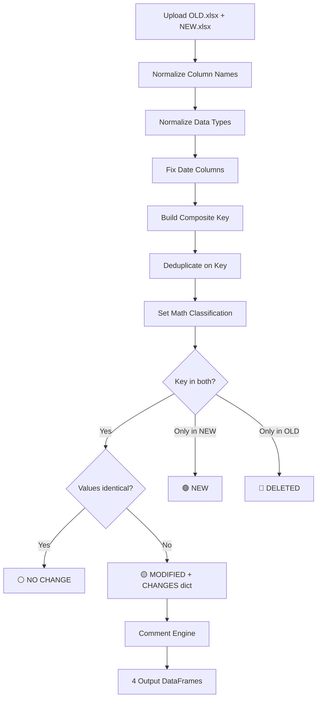
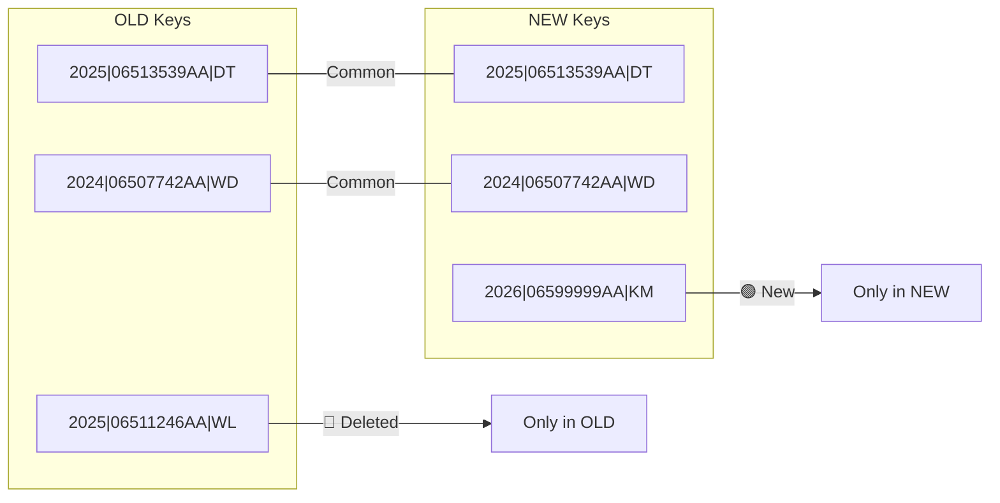

# Comparison Engine — Full Technical Deep-Dive

---

## 1. High-Level Flow



---

## 2. Step-by-Step Detailed Breakdown

### STEP 1 — Column Normalization

**File:** [analysis.py](file:///c:/project/FCS/preprocessing/analysis.py#L65-L92)

Both uploaded DataFrames go through `normalize_columns()`:

| Operation | Example |
|---|---|
| Uppercase | `model year` → `MODEL YEAR` |
| Strip whitespace | `  PART NO  ` → `PART NO` |
| Remove hidden chars | Zero-width spaces, control chars removed |
| Remove prefix | `2025-01.COLUMN` → `COLUMN` |
| Collapse spaces | `VEH   FAM` → `VEH FAM` |

**Result:** Both DataFrames now have identical, clean column names.

---

### STEP 2 — Data Type Normalization

**File:** [type_normalizer.py](file:///c:/project/FCS/preprocessing/type_normalizer.py#L38-L43)

| Rule | Action |
|---|---|
| Sentinel values | `?` → `NaN` |
| Null strings | `""`, `"NULL"`, `"None"` → `NaN` |
| Float columns | `MIN`, `TRGT`, `MAX`, `TORQUE SNUG TARGET` → `float64` |
| Integer columns | `TRGT2`, `QUANTITY` → `Int64` (nullable) |
| Date columns | `DECISION DATE` → `datetime64` |

---

### STEP 3 — Date Fixing

**File:** [comparator.py](file:///c:/project/FCS/comparison_engine/comparator.py#L151-L159)

Any column with `DATE` in its name gets special handling:

```python
pd.to_datetime(frame[col], errors='coerce').dt.strftime('%Y-%m-%d')
```

This converts Excel serial numbers (e.g., `45678`) into readable `YYYY-MM-DD` strings before comparison, preventing false "modified" flags caused by different date representations.

---

### STEP 4 — Composite Key Construction

**File:** [comparator.py](file:///c:/project/FCS/comparison_engine/comparator.py#L42-L96)

The comparison engine does **NOT** match rows by row number or index. Instead, it builds a deterministic **composite key** from three business identity columns:

```
__KEY__ = MODEL YEAR | PART NO | VEH FAM
```

**Example:**
```
Row data: MODEL YEAR=2025, PART NO=06513539AA, VEH FAM=DT
Key:      "2025|06513539AA|DT"
```

**Key Resolution Logic:**
The engine uses flexible column detection. It doesn't require exact column names — it checks a priority list of candidates:

| Logical Name | Accepted Variants |
|---|---|
| MODEL YEAR | `MODEL YEAR`, `MODEL_YEAR`, `MODELYEAR`, `MY` |
| PART NO | `PART NO`, `PART_NO`, `PARTNO`, `PART NUMBER` |
| VEH FAM | `VEH FAM`, `VEH_FAM`, `VEHFAM`, `VEHICLE FAMILY` |

**Cleaning during key build:**
- All values: `fillna("")` → `.str.strip()` → `.str.upper()`
- Float cleanup: `2025.0` → `2025` (removes trailing `.0`)
- If VEH FAM is missing from the file entirely, it uses `_` as placeholder

**Null Key Elimination:**
After building the key, rows where **ALL three segments** are null/empty are **dropped entirely**:
```python
# Dropped: "|" or "NAN|NAN|NAN" or "||" etc.
df = df[~df["__KEY__"].apply(
    lambda k: all(seg in _NULL_ALIASES for seg in k.split("|"))
)]
```

> [!IMPORTANT]
> This means rows with no MODEL YEAR, no PART NO, and no VEH FAM are silently eliminated. They never participate in any comparison.

---

### STEP 5 — Key-Based Deduplication

**File:** [comparator.py](file:///c:/project/FCS/comparison_engine/comparator.py#L165-L167)

After key construction, both DataFrames are deduplicated on `__KEY__`:

```python
old_keyed = old_keyed.drop_duplicates(subset=["__KEY__"], keep="first")
new_keyed = new_keyed.drop_duplicates(subset=["__KEY__"], keep="first")
```

| Rule | Effect |
|---|---|
| `keep="first"` | If two rows share the same `MODEL YEAR + PART NO + VEH FAM`, only the first row survives |
| Applied to both OLD and NEW | Ensures 1:1 key matching is possible |

> [!WARNING]
> If the input files contain multiple rows with the same composite key but different data values, only the **first occurrence** is kept. The rest are silently dropped.

---

### STEP 6 — Set Math Classification

**File:** [comparator.py](file:///c:/project/FCS/comparison_engine/comparator.py#L169-L175)

Using Python set operations on the composite keys:

```python
old_keys = set(old_keyed["__KEY__"])
new_keys = set(new_keyed["__KEY__"])

common_keys   = old_keys & new_keys      # Present in BOTH
new_only_keys = new_keys - old_keys      # Only in NEW file
deleted_keys  = old_keys - new_keys      # Only in OLD file
```



---

### STEP 7 — Column-Level Change Detection (for Common Keys)

**File:** [comparator.py](file:///c:/project/FCS/comparison_engine/comparator.py#L99-L125)

For every key that exists in **both** OLD and NEW, the engine does a **cell-by-cell comparison** across all comparable columns.

#### Which Columns Are Compared?

**Included:** Every column present in BOTH DataFrames, EXCEPT:

| Excluded Column | Reason |
|---|---|
| `__KEY__` | Internal composite key, not real data |
| `ROW ID` / `ROW_ID` / `ROWID` | Always unique — would make every row appear "modified" |
| `COMMENTS` | Generated column, not source data |
| `SR NO` / `SERIAL NO` / `S NO` / `S.NO` | Sequence numbers, always different |
| `INDEX` | Internal identifier |

These are defined in `_SKIP_COMPARE`:
```python
_SKIP_COMPARE = frozenset({
    "ROW ID", "ROW_ID", "ROWID", "ROW NO", "ROW_NO",
    "SR NO", "SR_NO", "SERIAL NO", "SERIAL_NO", "S NO", "S.NO",
    "INDEX", "__KEY__",
    "COMMENT", "COMMENTS",
})
```

#### How Are Values Compared?

**Function:** `detect_changes(old_row, new_row, compare_cols)`

For each column:
1. Convert both values to strings via `_safe_str()` (NaN → `""`, strip whitespace)
2. Compare strings: `old_val != new_val`
3. **Numeric equivalence check:** If strings differ, try `float(old_val) == float(new_val)` — this prevents false positives like `"0.0"` vs `"0"` or `"100.00"` vs `"100"`
4. If still different → record: `{column: "old_value → new_value"}`

**Result:**
- `{}` (empty dict) → **⚪ No Change**
- `{changes}` (non-empty) → **🟡 Modified** with the CHANGES dict attached

---

### STEP 8 — Comment Generation

**File:** [comment_engine.py](file:///c:/project/FCS/comparison_engine/comment_engine.py)

The CHANGES dict from Step 7 is converted into a readable COMMENTS string.

#### Priority Field Sequence:

| # | Field |
|---|---|
| 1 | TORQUE STRATEGY |
| 2 | TRGT |
| 3 | TORQUE SNUG TARGET |
| 4 | TRGT2 |
| 5 | PART USAGE DESC |
| 6 | PHYSCL DESC |
| 7 | QUANTITY |
| 8 | ENGINE |
| 9 | TRANSMISSION |
| 10 | NOUN DESC |

#### Mode-Based Behavior:

| Mode | COMMENTS Value |
|---|---|
| `modified` | Multi-line from CHANGES: `TRGT: 100 → 120\nQUANTITY: 5 → 8` |
| `new` | Static: `"Completely New Part Added"` |
| `deleted` | Static: `"Part Removed in New Report"` |
| `nochange` | Static: `"No Changes Detected"` |

The user can customize which fields appear via the UI multiselect.

---

### STEP 9 — Output

The engine returns **4 DataFrames**:

| DataFrame | Content | Source |
|---|---|---|
| `nochange_df` | NEW rows where all compared columns match OLD | `new_row` data |
| `modified_df` | NEW rows where at least 1 column differs + CHANGES dict | `new_row` data + CHANGES |
| `new_only_df` | Rows with keys only in NEW file | `new_keyed` filtered |
| `deleted_df` | Rows with keys only in OLD file | `old_keyed` filtered |

> [!NOTE]
> For "Modified" and "No Change", the output contains the **NEW** row's data (not the OLD). The OLD values only appear inside the CHANGES dict as part of the `"old → new"` strings.

---

## 3. Complete Data Flow Summary

```
OLD.xlsx                          NEW.xlsx
   │                                 │
   ▼                                 ▼
normalize_columns()             normalize_columns()
   │                                 │
   ▼                                 ▼
normalize_types()               normalize_types()
   │                                 │
   ▼                                 ▼
fix DATE columns                fix DATE columns
   │                                 │
   ▼                                 ▼
build_composite_key()           build_composite_key()
__KEY__ = MY|PN|VF              __KEY__ = MY|PN|VF
   │                                 │
   ▼                                 ▼
drop_duplicates(__KEY__)        drop_duplicates(__KEY__)
   │                                 │
   └──────────┬──────────────────────┘
              │
              ▼
        SET OPERATIONS
   ┌──────────┼──────────────┐
   │          │              │
   ▼          ▼              ▼
DELETED    COMMON         NEW ONLY
(old-new)  (old ∩ new)    (new-old)
              │
              ▼
    detect_changes() per row
    (skip ROW ID, COMMENTS, etc.)
    (numeric equivalence check)
              │
        ┌─────┴─────┐
        │           │
        ▼           ▼
   NO CHANGE    MODIFIED
   (empty {})   ({changes})
                    │
                    ▼
            comment_engine
            (priority ordering)
                    │
                    ▼
            4 Output DataFrames
            → UI Tabs + Excel Export
```

---

## 4. Key Rules to Remember

1. **Composite Key = identity.** Two rows are "the same part" only if `MODEL YEAR + PART NO + VEH FAM` match.
2. **First occurrence wins.** If duplicates exist on the key, only the first row is kept.
3. **ROW ID is never compared.** It's excluded from change detection to prevent false positives.
4. **COMMENTS is never compared.** It's a generated column.
5. **Numeric equivalence matters.** `"0.0"` vs `"0"` is NOT a change.
6. **Date normalization prevents noise.** Excel serial numbers are converted before comparison.
7. **Output uses NEW data.** Modified/NoChange rows contain the NEW file's values. OLD values only appear in the CHANGES strings.
