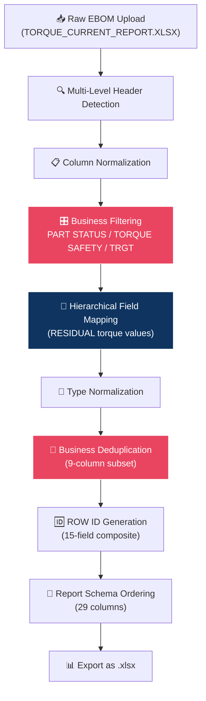
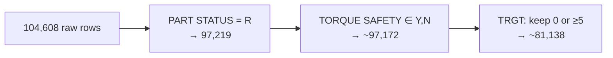
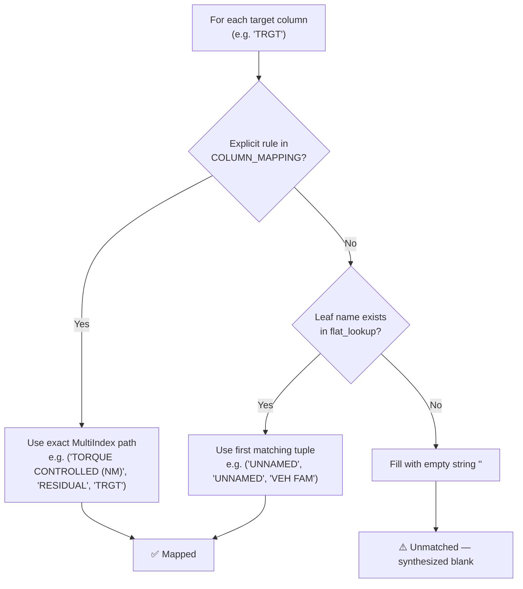

# Report Generation Module — Full Technical Deep-Dive

---

## 1. Purpose

The Report Generation module converts a **raw MBOM/EBOM file** (e.g., `TORQUE_CURRENT_REPORT.XLSX`) into a **comparison-compatible business report** that exactly replicates the output of the legacy Excel macro. This generated report can then be fed directly into the Comparison Engine.

---

## 2. High-Level Pipeline



---

## 3. Step-by-Step Detailed Breakdown

### STEP 1 — Target Schema Resolution

**File:** [builder.py](file:///c:/project/FCS/report_generator/builder.py#L23-L34) | [report_schema.py](file:///c:/project/FCS/config/report_schema.py)

The system determines what columns the final report must contain:

| Mode | Source | Behavior |
|---|---|---|
| **Default** (no template uploaded) | `config/report_schema.py` | Uses 29 hardcoded columns extracted from `new_data.xlsx` |
| **Override** (template uploaded) | Uploaded `.xlsx` file | Reads column headers from the uploaded file |

**Default Schema (29 columns, in order):**
```
MODEL YEAR → PART NO → VEH FAM → VEH LINE → BODY STYLE →
PART USAGE DESC → PHYSCL DESC → QUANTITY → DEPT_REL →
TORQUE SAFETY → TIGHTENING CLASS → TORQUE STRATEGY →
MIN → TRGT → MAX → TORQUE SNUG TARGET → TRGT2 →
DECISIONED CN # → DECISION DATE → VSC → VSC NAME →
END ITEM PART → ENGINE → TRANSMISSION → CONDITION DESC →
NOUN NAME → NOUN DESC → COMMENTS → ROW ID
```

---

### STEP 2 — Multi-Level Header Detection

**File:** [structure_analyzer.py](file:///c:/project/FCS/preprocessing/structure_analyzer.py#L22-L62)

The raw MBOM file has a **3-row multi-level header** structure. Standard `pd.read_excel` would misinterpret this.

**How it works:**

1. Read the first 20 rows raw (no header) to **scan** for the business header row
2. Look for a row containing ALL of: `MODEL YEAR`, `PART NO`, `VEH FAM`
3. Once found at row index `N`, load the file using rows `[N-2, N-1, N]` as a **MultiIndex header**

**Example from TORQUE_CURRENT_REPORT.XLSX:**
```
Row 0: [Category groupings like "TORQUE CONTROLLED (NM)", "ANGLE CONTROL..."]
Row 1: [Sub-groups like "DYNAMIC", "RESIDUAL", "ANGLE SPECS"]  
Row 2: [Leaf columns like "MODEL YEAR", "PART NO", "MIN", "TRGT", "MAX"]
        ← This is the detected business header (index 2)
```

**Result:** A DataFrame with **MultiIndex (tuple) columns** like:
```python
('TORQUE CONTROLLED (NM)', 'RESIDUAL', 'MIN')
('TORQUE CONTROLLED (NM)', 'RESIDUAL', 'TRGT')
('TORQUE CONTROLLED (NM)', 'RESIDUAL', 'MAX')
('ANGLE CONTROL - TORQUE MONITOR(NM)', 'ANGLE SPECS', 'TRGT')
('UNNAMED: 1_LEVEL_0', 'UNNAMED: 1_LEVEL_1', 'PART STATUS')
```

---

### STEP 3 — Column Normalization

**File:** [normalizer.py](file:///c:/project/FCS/preprocessing/normalizer.py)

All column names (including multi-index tuples) are cleaned:

| Operation | Before | After |
|---|---|---|
| Remove hidden chars | `\u200BPART NO` | `PART NO` |
| Uppercase | `model year` | `MODEL YEAR` |
| Strip whitespace | `  TRGT  ` | `TRGT` |
| Collapse spaces | `VEH   FAM` | `VEH FAM` |
| NaN handling | `NaN` level | `UNNAMED` |

Applied to each level of the MultiIndex tuple individually.

---

### STEP 4 — Business Filtering

**File:** [business_filters.py](file:///c:/project/FCS/validation/business_filters.py) | [business_rules.py](file:///c:/project/FCS/config/business_rules.py)

Three mandatory filters are applied **on the raw MultiIndex DataFrame** (before field mapping flattens the columns). This matches the legacy macro's behavior of filtering before report assembly.

#### Filter 1: PART STATUS

| Rule | Keep | Remove |
|---|---|---|
| Column | `('UNNAMED: 1_LEVEL_0', 'UNNAMED: 1_LEVEL_1', 'PART STATUS')` | |
| Logic | `PART STATUS == "R"` | Blanks, other statuses |
| Impact | ~7,389 rows removed from 104,608 | |

> [!IMPORTANT]
> `PART STATUS` exists only in the raw MBOM. It does NOT appear in the final report schema. It is used purely as a filter gate.

#### Filter 2: TORQUE SAFETY

| Rule | Keep | Remove |
|---|---|---|
| Column | `('TORQUE REPORT', 'UNNAMED: 18_LEVEL_1', 'TORQUE SAFETY')` | |
| Logic | `TORQUE SAFETY in ["Y", "N"]` | Blanks, `?` |
| Impact | ~47 rows removed (mostly `?` values) | |

#### Filter 3: TRGT (Residual Torque)

| Rule | Keep | Remove |
|---|---|---|
| Column | `('TORQUE CONTROLLED (NM)', 'RESIDUAL', 'TRGT')` | |
| Logic | `TRGT == 0` OR `TRGT >= 5` | `0 < TRGT < 5` |
| Impact | ~16,034 rows removed | |



> [!NOTE]
> Manager explicitly confirmed: **00.00 torque values must be KEPT.** Only the narrow range `0 < TRGT < 5` is removed.

---

### STEP 5 — Hierarchical Field Mapping

**File:** [builder.py](file:///c:/project/FCS/report_generator/builder.py#L74-L116) | [column_mapping.py](file:///c:/project/FCS/config/column_mapping.py)

This is the most critical step. The raw MBOM has **50+ MultiIndex columns**, but the output report needs only **29 flat columns**. Each target column must be mapped to the correct source.

#### Mapping Strategy (Two-Pass)



#### Explicit COLUMN_MAPPING Rules (Critical Business Logic)

These 4 columns require explicit MultiIndex paths because their leaf name `TRGT` or `MIN` appears multiple times across different parent groups:

| Target Column | MultiIndex Path | Business Rule |
|---|---|---|
| **MIN** | `('TORQUE CONTROLLED (NM)', 'RESIDUAL', 'MIN')` | Must be RESIDUAL, NOT Dynamic |
| **TRGT** | `('TORQUE CONTROLLED (NM)', 'RESIDUAL', 'TRGT')` | Must be RESIDUAL, NOT Dynamic |
| **MAX** | `('TORQUE CONTROLLED (NM)', 'RESIDUAL', 'MAX')` | Must be RESIDUAL, NOT Dynamic |
| **TRGT2** | `('ANGLE CONTROL - TORQUE MONITOR(NM)', 'ANGLE SPECS', 'TRGT')` | From Angle Control, NOT Torque |

> [!CAUTION]
> **Why this matters:** The raw MBOM contains FOUR different `TRGT` columns:
> - `('TORQUE CONTROLLED (NM)', 'DYNAMIC', 'TRGT')` ← WRONG
> - `('TORQUE CONTROLLED (NM)', 'RESIDUAL', 'TRGT')` ← CORRECT for TRGT
> - `('TORQUE CONTROL - ANGLE MONITOR(NM)', 'DYNAMIC SPECS', 'TRGT')` ← WRONG
> - `('ANGLE CONTROL - TORQUE MONITOR(NM)', 'ANGLE SPECS', 'TRGT')` ← CORRECT for TRGT2
>
> Without explicit mapping, the flat fallback would pick the FIRST one found (Dynamic), producing incorrect data.

#### Flat Fallback Mapping

For all other columns (e.g., `MODEL YEAR`, `PART NO`, `VEH FAM`, `QUANTITY`), the system builds a lookup dictionary:

```python
flat_lookup = {leaf_name: full_tuple}
# Example: {"MODEL YEAR": ("UNNAMED_0", "UNNAMED_1", "MODEL YEAR")}
```

If the target column name matches a leaf, it maps automatically.

---

### STEP 6 — Type Normalization

**File:** [type_normalizer.py](file:///c:/project/FCS/preprocessing/type_normalizer.py)

After mapping, the flattened DataFrame is cleaned for consistent typing:

| Rule | Columns | Action |
|---|---|---|
| Sentinel removal | All | `?` → `NaN` |
| Null standardization | All | `""`, `"NULL"`, `"None"` → `NaN` |
| Float conversion | `MIN`, `TRGT`, `MAX`, `TORQUE SNUG TARGET` | `pd.to_numeric(errors='coerce')` |
| Integer conversion | `TRGT2`, `QUANTITY` | `pd.to_numeric().astype('Int64')` (nullable) |
| Date conversion | `DECISION DATE` | `pd.to_datetime(errors='coerce')` |

---

### STEP 7 — Business Deduplication

**File:** [deduplication_validator.py](file:///c:/project/FCS/validation/deduplication_validator.py) | [deduplication_config.py](file:///c:/project/FCS/config/deduplication_config.py)

The raw MBOM contains duplicate rows. The legacy macro silently removed them. The Python pipeline replicates this using **subset-based deduplication**.

#### Dedup Subset (9 columns):

```python
DEDUP_COLUMNS = [
    "MODEL YEAR",       # Identity
    "VEH FAM",          # Identity
    "PART NO",          # Part identifier
    "PART USAGE DESC",  # Application context
    "PHYSCL DESC",      # Physical description
    "TORQUE STRATEGY",  # Torque method
    "MIN",              # Residual torque min
    "TRGT",             # Residual torque target
    "MAX",              # Residual torque max
]
```

**Logic:**
```python
df.drop_duplicates(subset=DEDUP_COLUMNS, keep='first')
```

| Rule | Explanation |
|---|---|
| `subset=DEDUP_COLUMNS` | Only these 9 columns are checked for equality |
| `keep='first'` | If two rows match on all 9 columns, the first row survives |
| Rows that differ in ANY of the 9 | Both are preserved |

> [!WARNING]
> This is **NOT** full-row equality. Two rows can have different `BODY STYLE` or `ENGINE` values but identical dedup columns — only one will survive. This matches the macro's business behavior.

**Typical impact:** ~81,138 rows → reduced significantly based on data vintage.

---

### STEP 8 — ROW ID Generation

**File:** [rowid_generator.py](file:///c:/project/FCS/utils/rowid_generator.py) | [rowid_config.py](file:///c:/project/FCS/config/rowid_config.py)

A deterministic ROW ID is generated for each surviving row by concatenating **15 fields** with pipe `|` separators.

#### ROW ID Composition (15 fields):

| # | Field | Purpose |
|---|---|---|
| 1 | MODEL YEAR | Part vintage |
| 2 | PART NO | Primary identifier |
| 3 | VEH FAM | Vehicle family |
| 4 | VEH LINE | Vehicle line |
| 5 | BODY STYLE | Body configuration |
| 6 | PART USAGE DESC | Application description |
| 7 | PHYSCL DESC | Physical description |
| 8 | ENGINE | Engine code |
| 9 | END ITEM PART | End item reference |
| 10 | CONDITION DESC | Condition context |
| 11 | DEPT_REL | Department release |
| 12 | COMMENTS | Additional notes |
| 13 | VSC NAME | VSC descriptor |
| 14 | TORQUE SAFETY | Safety classification |
| 15 | TORQUE STRATEGY | Strategy type |
| 16 | TIGHTENING CLASS | Tightening class |

**Example ROW ID:**
```
2025|06513539AA|DT|S 1 6|98 /41 91 98|BOLT TO FRAME|M10X1.50X30.00|ELD||
|1630||Y|A|B
```

**Cleaning rules:**
- `NaN` → empty string (keeps pipe separator)
- Float cleanup: `2025.0` → `2025`
- All values stripped of whitespace

> [!NOTE]
> The ROW ID is generated **AFTER** deduplication. This ensures only unique business rows get IDs. The ROW ID is used by the Comparison Engine for searching but is **never compared** during change detection.

---

### STEP 9 — Report Schema Ordering

**File:** [builder.py](file:///c:/project/FCS/report_generator/builder.py#L135-L137)

The final DataFrame is reordered to exactly match the macro's column sequence:

```python
final_ordered_columns = [col for col in target_columns if col in df_final.columns]
df_final = df_final[final_ordered_columns]
```

This ensures the Python output is a **structural drop-in replacement** — same columns, same order.

---

### STEP 10 — Post-Dedup Validation

**File:** [deduplication_validator.py](file:///c:/project/FCS/validation/deduplication_validator.py#L52-L70)

After everything, the system validates ROW ID uniqueness:

| Check | Action |
|---|---|
| Count ROW IDs with duplicates | `df["ROW ID"].value_counts() > 1` |
| If conflicts found | Log warning + sample conflicting IDs |
| If all unique | Log success ✅ |

Conflicting ROW IDs (same ROW ID, different business data) are **preserved and flagged**, never silently deleted.

---

## 4. Configuration File Summary

All business logic is centralized in `config/`:

```
config/
├── business_rules.py       # Filter rules (PART STATUS, TORQUE SAFETY, TRGT thresholds)
├── column_mapping.py       # MultiIndex paths for MIN/TRGT/MAX/TRGT2
├── deduplication_config.py  # 9-column subset for dedup
├── report_schema.py        # 29-column output schema + typing groups
└── rowid_config.py         # 15 fields composing the ROW ID
```

---

## 5. Export Pipeline

**File:** [report_exporter.py](file:///c:/project/FCS/exports/report_generation_export/report_exporter.py)

The export pipeline is **completely independent** from the Comparison Engine's export:

| Feature | Report Generation | Comparison Engine |
|---|---|---|
| Default filename | `TORQUE_REPORT_<DATE>.xlsx` | `COMPARISON_REPORT_<DATE>.xlsx` |
| Sheets | 1 sheet: `Report` | 4 sheets: `No Change / Modified / New / Deleted` |
| Formatting | `report_formatting.py` | `comparison_formatting.py` |
| Exporter | `report_exporter.py` | `comparison_exporter.py` |
| Shared | `common/base_formatting.py` + `common/utils.py` | Same shared base |

**UX Flow:**
1. DataFrame generated and preview displayed instantly
2. User clicks **"Prepare Download"** → cached `@st.cache_data` formatting runs once
3. **"Download Report"** button appears → instant download

---

## 6. Complete Data Flow Summary

```
TORQUE_CURRENT_REPORT.XLSX (Raw MBOM)
          │
          ▼
  ┌─ STEP 1: Target Schema ─────────────────────────┐
  │  Default: config/report_schema.py (29 columns)   │
  │  Override: uploaded template file                 │
  └──────────────────────────────────────────────────┘
          │
          ▼
  ┌─ STEP 2: Header Detection ──────────────────────┐
  │  Scan first 20 rows for MODEL YEAR + PART NO     │
  │  Load with 3-row MultiIndex header               │
  │  Result: 104,608 rows × 50+ multi-index columns  │
  └──────────────────────────────────────────────────┘
          │
          ▼
  ┌─ STEP 3: Normalize ─────────────────────────────┐
  │  Uppercase + strip + remove hidden chars          │
  └──────────────────────────────────────────────────┘
          │
          ▼
  ┌─ STEP 4: Business Filters ─────────────────────┐
  │  PART STATUS = "R"       → removes ~7,389 rows   │
  │  TORQUE SAFETY ∈ {Y, N}  → removes ~47 rows      │
  │  TRGT: keep 0 or ≥5      → removes ~16,034 rows  │
  │  Result: ~81,138 rows                             │
  └──────────────────────────────────────────────────┘
          │
          ▼
  ┌─ STEP 5: Field Mapping ─────────────────────────┐
  │  Explicit: MIN/TRGT/MAX → RESIDUAL path           │
  │  Explicit: TRGT2 → ANGLE CONTROL path             │
  │  Fallback: leaf name matching for other 25 cols   │
  │  Result: 29 flat columns (matching macro schema)  │
  └──────────────────────────────────────────────────┘
          │
          ▼
  ┌─ STEP 6: Type Normalization ────────────────────┐
  │  Floats, Integers, Dates, Null handling           │
  └──────────────────────────────────────────────────┘
          │
          ▼
  ┌─ STEP 7: Business Deduplication ────────────────┐
  │  Subset: MY + VEH FAM + PART NO + PART USAGE     │
  │         + PHYSCL DESC + TORQUE STRATEGY           │
  │         + MIN + TRGT + MAX                        │
  │  keep='first'                                     │
  └──────────────────────────────────────────────────┘
          │
          ▼
  ┌─ STEP 8: ROW ID Generation ────────────────────┐
  │  15-field pipe-separated composite ID             │
  └──────────────────────────────────────────────────┘
          │
          ▼
  ┌─ STEP 9: Schema Ordering ──────────────────────┐
  │  Reorder to exact macro column sequence           │
  └──────────────────────────────────────────────────┘
          │
          ▼
  ┌─ STEP 10: Validation ──────────────────────────┐
  │  Check ROW ID uniqueness                          │
  │  Flag conflicting duplicates                      │
  └──────────────────────────────────────────────────┘
          │
          ▼
     📊 TORQUE_REPORT_<DATE>.xlsx
     (Drop-in replacement for macro report)
```

---

## 7. Key Rules to Remember

1. **Filters run BEFORE mapping.** Business rows are eliminated on the raw multi-index data, not after flattening.
2. **RESIDUAL, not Dynamic.** MIN/TRGT/MAX must always come from the RESIDUAL torque hierarchy.
3. **TRGT2 ≠ TRGT.** TRGT2 comes from a completely different parent group (ANGLE CONTROL).
4. **Deduplication uses 9 columns.** Not full-row equality, not just PART NO.
5. **ROW ID is generated AFTER dedup.** Only surviving rows get IDs.
6. **Schema is hardcoded.** No need to upload a template every time — `config/report_schema.py` is the authority.
7. **00.00 torque values are KEPT.** Only `0 < TRGT < 5` is removed.
8. **PART STATUS is a filter, not an output column.** It exists only in the raw MBOM and is never included in the final report.
9. **Export pipeline is independent.** Report generation and comparison have completely separate formatters, filenames, and exporters.
