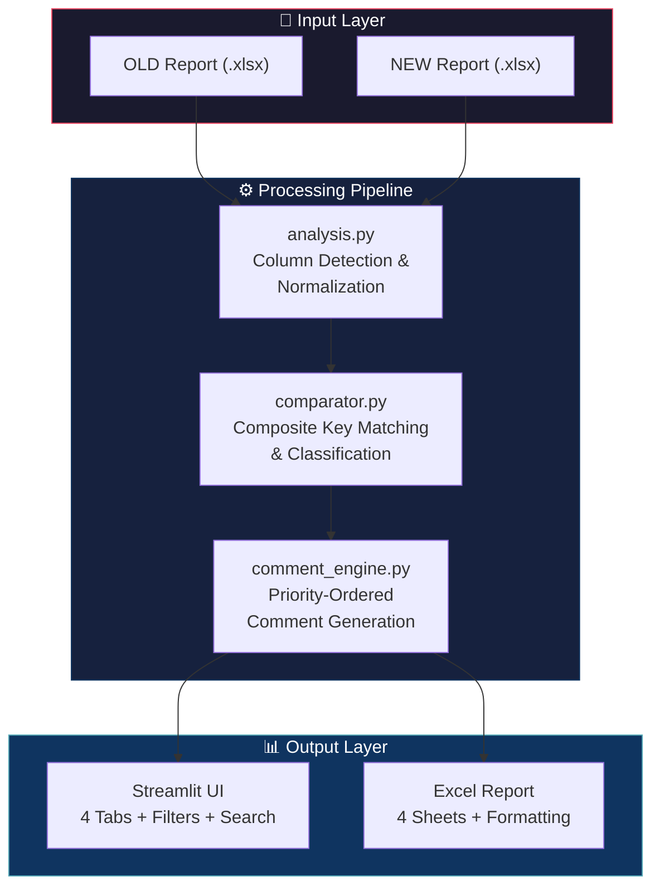
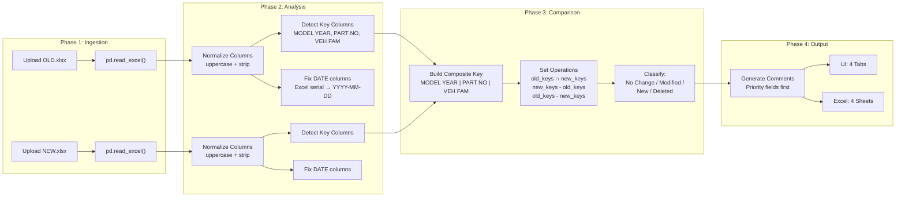
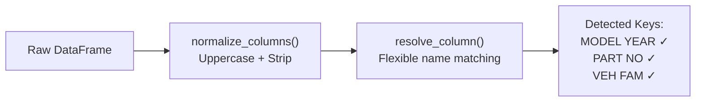
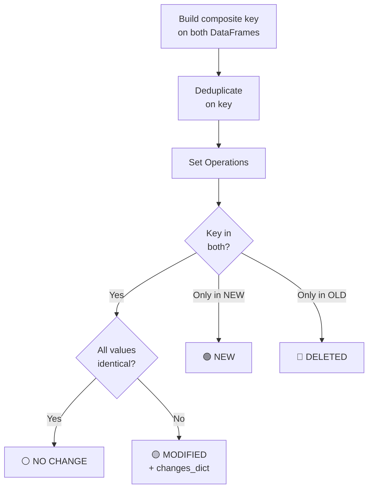

# 🔧 Industrial Comparison Analysis System (FCS)

## Presentation Document — Implementation Details

---

## 1. Project Overview

The **Fastener Comparison System (FCS)** is a production-grade tool that compares two versions of industrial part reports (OLD vs NEW) and automatically classifies every part into one of four categories:

| Category | Meaning |
|---|---|
| ⚪ **No Change** | Part exists in both reports with identical values |
| 🟡 **Modified** | Part exists in both but one or more fields changed |
| 🟢 **New** | Part only exists in the NEW report |
| 🔴 **Deleted** | Part only exists in the OLD report |

> [!IMPORTANT]
> The entire system is **rule-based** — no AI/LLM is used for classification or logic. All decisions are deterministic Python code.

---

## 2. Technology Stack

| Layer | Technology | Version | Purpose |
|---|---|---|---|
| **Language** | Python | 3.11 | Core logic |
| **UI Framework** | Streamlit | Latest | Interactive web dashboard |
| **Data Processing** | Pandas | Latest | DataFrame operations, merging, filtering |
| **Excel Reading** | openpyxl | Latest | Reading `.xlsx` input files |
| **Excel Writing** | XlsxWriter | Latest | Formatted Excel report generation |
| **Deployment** | Local / Streamlit Cloud | — | Runs as a web app on `localhost:8501` |

### Key Libraries
```
streamlit        → Web UI framework (reactive, no frontend code needed)
pandas           → Data manipulation and comparison engine
xlsxwriter       → Professional Excel output with formatting
openpyxl         → Excel file reader
```

---

## 3. System Architecture



---

## 4. Data Flow & Processing Pipeline



---

## 5. Module Breakdown

### 📁 Project Structure

```
c:\project\FCS\
├── app.py                    ← Main Streamlit UI
├── modules/
│   ├── ingestion.py          ← Excel file reader
│   ├── analysis.py           ← Column detection & normalization
│   ├── comparator.py         ← Core comparison engine
│   ├── comment_engine.py     ← Rule-based comment generator
│   └── exporter.py           ← Formatted Excel report writer
├── test_comparator.py        ← Automated test suite
├── requirements.txt          ← Python dependencies
└── venv/                     ← Virtual environment
```

---

### Module 1: `analysis.py` — File Structure Analysis

**Purpose:** Dynamically detect and normalize column names regardless of naming variations.



**Key Features:**
- Handles naming variations: `MODEL YEAR`, `MODEL_YEAR`, `Model Year`, `MODELYEAR`
- Two-stage matching: exact match → partial/substring match
- Returns structured analysis report with column map and data types

---

### Module 2: `comparator.py` — Core Comparison Engine

**Purpose:** Compare two datasets using composite key matching and classify every row.

**Composite Key:**
```
__KEY__ = MODEL YEAR | PART NO | VEH FAM
```

**Algorithm:**


**Excluded from Comparison:**
| Column | Reason |
|---|---|
| ROW ID | Unique per row, always different |
| COMMENTS | Generated column, not source data |
| INDEX | Internal identifier |
| SR NO | Serial number, always unique |

**Date Handling:**
- Columns containing "DATE" in the name are auto-converted from Excel serial numbers to `YYYY-MM-DD` format

---

### Module 3: `comment_engine.py` — Comment Generation

**Purpose:** Convert raw change dictionaries into human-readable, priority-ordered comment strings.

**Priority Field Sequence (Strict Order):**

| # | Field |
|---|---|
| 1 | TORQUE STRATEGY |
| 2 | TRGT |
| 3 | TORQUE SNUG TARGET |
| 4 | TRGT2 |
| 5 | PART USAGE DESC |
| 6 | PHYSCL DESC |
| 7 | QUANTITY |
| 8 | ENGINE |
| 9 | TRANSMISSION |
| 10 | NOUN DESC |

**Comment Format (one field per line):**
```
TRGT: 100 → 120
QUANTITY: 5 → 8
PART USAGE DESC: BOLT TO FRAME → BOLT TO PANEL
```

**Rules:**
- Priority fields appear first, in strict sequence order
- Remaining changed fields appear after
- User can customize which fields appear via UI multiselect
- No AI/LLM — purely rule-based string formatting

---

### Module 4: `exporter.py` — Excel Report Generator

**Purpose:** Generate a professionally formatted, multi-sheet Excel workbook.

**Output Structure:**

| Sheet | Tab Color | Content |
|---|---|---|
| No Change | Grey | Parts unchanged between reports |
| Modified | Amber | Parts with field changes + COMMENTS |
| New | Green | Parts only in NEW report |
| Deleted | Red | Parts only in OLD report |

**Formatting Features:**
- ✅ Auto-fit column widths
- ✅ Frozen header row
- ✅ AutoFilter on all columns
- ✅ Alternating row colors
- ✅ COMMENTS column highlighted (yellow background, text wrap)
- ✅ Color-coded sheet tabs
- ✅ Professional Calibri font, borders, zoom level

---

### Module 5: `app.py` — Streamlit UI

**Purpose:** Interactive web dashboard for upload, filtering, viewing, searching, and export.


**UI Features:**
- Two-file upload (OLD + NEW)
- `@st.cache_data` — files loaded and compared **only once**, filter changes are **instant**
- MODEL YEAR multiselect filter
- Comment field selector with presets ("Important Only" / "All Fields")
- Comment text filter on Modified tab (search within comments)
- ROW ID search with detailed view: table for data + line-by-line for comments
- One-click Excel download

---

## 6. Performance Optimizations

| Optimization | Implementation |
|---|---|
| **Caching** | `@st.cache_data` — heavy file I/O and comparison run only once per file pair |
| **Set operations** | Key matching uses Python `set` intersection/difference — O(n) |
| **Lookup dicts** | Modified row comparison uses `set_index()` for O(1) row access |
| **No nested loops** | Comparison is key-based, not row-by-row cross-product |
| **Filter = instant** | Sidebar/filter changes only re-filter cached DataFrames, no re-computation |

---

## 7. Key Design Decisions

| Decision | Rationale |
|---|---|
| **Rule-based, no AI** | Deterministic, auditable results. No API costs. Works offline. |
| **Composite key** | Single PART NO is not unique across model years and vehicle families |
| **Dynamic column detection** | Input files from different teams have different naming conventions |
| **Priority field ordering** | Domain experts need critical torque/quantity changes visible first |
| **4 categories** | "No Change" category was added because raw input files (unlike pre-compared files) contain identical rows |
| **ROW ID excluded from comparison** | Always unique, would make every row appear "modified" |
| **Date auto-conversion** | Excel stores dates as serial numbers — auto-detected and formatted |

---

## 8. Testing

**Automated test suite** (`test_comparator.py`) validates:

| Test | Assertion |
|---|---|
| File structure detection | KEY columns detected correctly |
| No Change classification | Identical rows → No Change (not Modified) |
| Modified detection | Changed values → Modified with correct CHANGES dict |
| New detection | Key only in NEW → New |
| Deleted detection | Key only in OLD → Deleted |
| Comment format | Priority ordering, newline separation |
| Excel export | 4 sheets in correct order, valid file |

```
ALL TESTS PASSED ✅
```

---

## 9. How to Run

```powershell
cd c:\project\FCS
& venv\Scripts\Activate.ps1
streamlit run app.py
```

Opens at `http://localhost:8501`

---

## 10. Summary

The FCS system transforms a manual, error-prone comparison process into an **automated, rule-based pipeline** that:

1. **Reads** two Excel reports
2. **Analyzes** file structure dynamically
3. **Compares** using composite keys (MODEL YEAR + PART NO + VEH FAM)
4. **Classifies** every row into 4 categories
5. **Generates** priority-ordered comments
6. **Displays** results in an interactive dashboard
7. **Exports** a professionally formatted Excel report

All without any AI dependency — **100% deterministic, auditable, and fast**.
